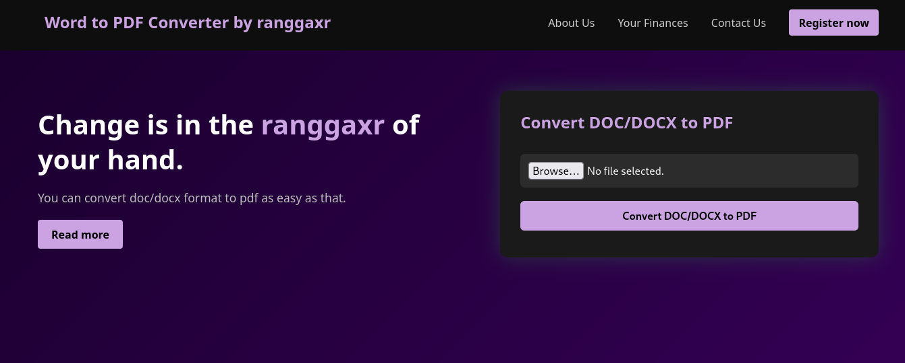

# 📝 Convert Word to PDF

**Convert Word to PDF** adalah aplikasi web sederhana yang memungkinkan pengguna mengunggah file Microsoft Word (.docx) dan mengonversinya menjadi file PDF secara otomatis. Cocok untuk kebutuhan tugas, dokumen kerja, atau konversi cepat dokumen pribadi.

---

## 📸 Tampilan Aplikasi

Berikut adalah tampilan halaman utama dari aplikasi ini:




---

## 🎯 Fitur Utama

- Upload file Word (.docx) langsung dari browser
- Konversi otomatis menjadi file PDF
- File PDF langsung bisa diunduh
- Tampilan halaman simpel dan ramah pengguna
- File sementara akan dihapus otomatis setelah proses selesai
- Bisa dijalankan di komputer lokal atau online (Railway/Docker)

---

## 📁 Struktur Proyek

.
├── app.py ← Aplikasi Flask utama
├── pdf.png ← Gambar tampilan halaman
├── templates/ ← Folder HTML (index.html)
├── requirements.txt ← Daftar library Python
├── Dockerfile ← (opsional) untuk Docker
├── railway.toml ← (opsional) untuk Railway
└── README.md ← Dokumentasi proyek


---

## 🛠 Teknologi yang Digunakan

- Python 3
- Flask
- python-docx
- reportlab
- HTML/CSS (template)
- (opsional) Docker & Railway

---

## 📥 Cara Instalasi dan Menjalankan Aplikasi

Ikuti langkah-langkah di bawah ini untuk menjalankan proyek di komputer kamu:

1. **Pastikan Python 3 sudah terpasang di komputermu**  
   Download dari: https://www.python.org/downloads/

2. **Clone atau download semua file proyek ini**, lalu buka folder-nya.

3. **(Opsional) Buat virtual environment (disarankan)**  
   ```bash
   python -m venv venv
   source venv/bin/activate  # untuk Linux/macOS
   venv\Scripts\activate     # untuk Windows
   ```
    Install semua dependensi dari requirements.txt
```bash
pip install -r requirements.txt
```
Jalankan aplikasi Flask-nya
```
python app.py
```
Buka browser dan akses:

http://localhost:5000

Gunakan aplikasinya:

  Unggah file .docx

  Klik tombol Convert

  Unduh hasil file PDF
